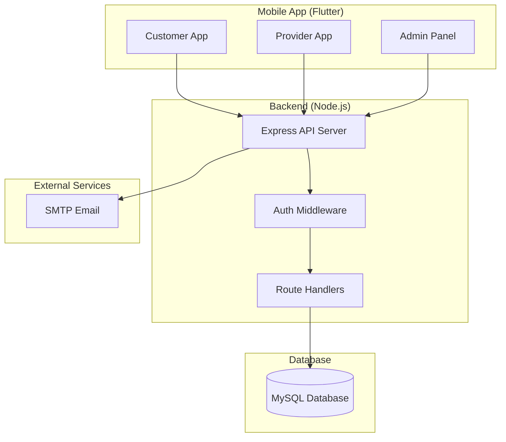
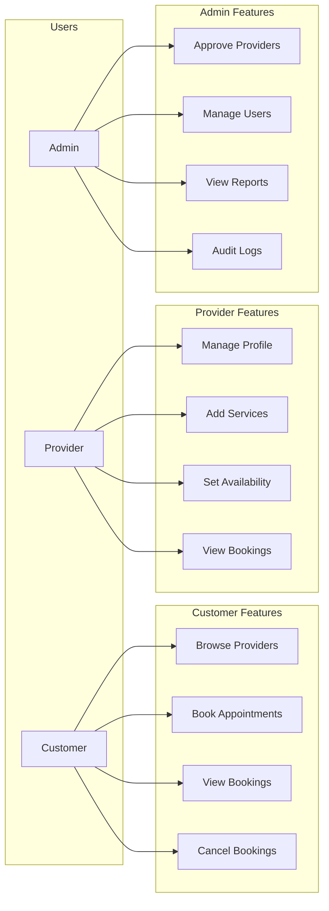
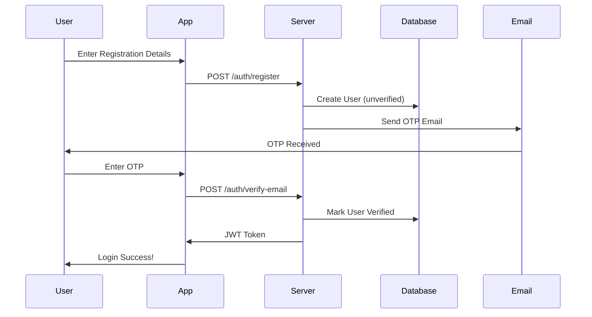
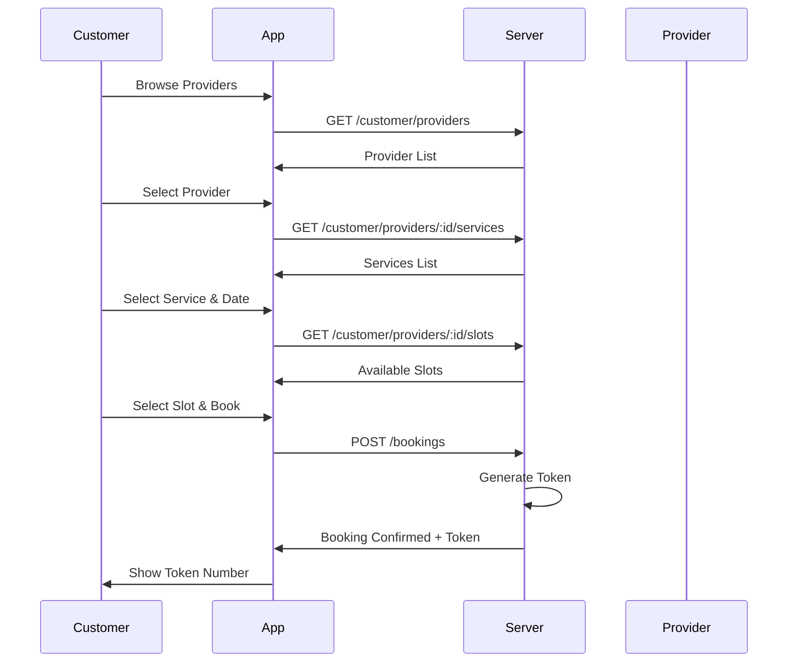
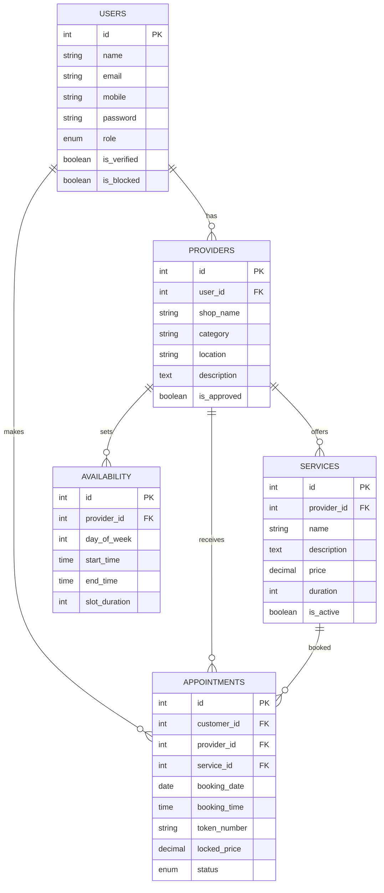

# BookNex - Appointment Management System
## Complete Project Documentation

---

## 📋 Project Overview

**BookNex** is a comprehensive appointment booking system that connects customers with service providers. The system includes a Flutter mobile app and Node.js backend API.

### Technology Stack

| Component | Technology |
|-----------|------------|
| Mobile App | Flutter (Dart) |
| Backend API | Node.js + Express.js |
| Database | MySQL |
| Authentication | JWT Tokens |
| Hosting | cPanel |

---

## 🏗 System Architecture

---

## 👥 User Roles & Access

---

## 🔐 Authentication Flow

---

## 📅 Booking Flow

---

## 🗄 Database Schema

---

## 📱 App Screens

### Customer Screens
| Screen | Purpose |
|--------|---------|
| Home | Dashboard with quick actions |
| Browse Providers | Search & filter providers |
| Provider Details | View services, select date/slot |
| My Bookings | View all bookings, cancel option |

### Provider Screens
| Screen | Purpose |
|--------|---------|
| Dashboard | Stats overview |
| Services | Add/View/Delete services |
| Availability | Set weekly schedule |
| Profile | Update business info |

### Admin Screens
| Screen | Purpose |
|--------|---------|
| Dashboard | Stats & quick actions |
| Pending Providers | Approve/Reject providers |
| Manage Users | Block/Unblock users |
| Reports | Revenue & analytics |
| Audit Logs | Login history |

---

## 🔗 API Endpoints

### Authentication
| Method | Endpoint | Description |
|--------|----------|-------------|
| POST | /auth/register | User registration |
| POST | /auth/login | User login |
| POST | /auth/verify-email | OTP verification |
| POST | /auth/forgot-password | Reset password |

### Customer
| Method | Endpoint | Description |
|--------|----------|-------------|
| GET | /customer/providers | List approved providers |
| GET | /customer/providers/:id | Provider details |
| GET | /customer/providers/:id/services | Provider's services |
| GET | /customer/providers/:id/slots | Available time slots |
| GET | /customer/categories | List categories |

### Booking
| Method | Endpoint | Description |
|--------|----------|-------------|
| POST | /bookings | Create booking |
| GET | /bookings/my | Customer's bookings |
| PUT | /bookings/:id/cancel | Cancel booking |

### Provider
| Method | Endpoint | Description |
|--------|----------|-------------|
| GET | /provider/profile | Get profile |
| PUT | /provider/profile | Update profile |
| POST | /provider/services | Add service |
| GET | /provider/services | List services |
| DELETE | /provider/services/:id | Delete service |
| POST | /provider/availability | Set availability |
| GET | /provider/availability | Get schedule |

### Admin
| Method | Endpoint | Description |
|--------|----------|-------------|
| GET | /admin/providers/pending | Pending providers |
| PUT | /admin/providers/:id/approve | Approve provider |
| PUT | /admin/providers/:id/reject | Reject provider |
| GET | /admin/users | All users |
| PUT | /admin/users/:id/block | Block user |
| PUT | /admin/users/:id/unblock | Unblock user |
| GET | /admin/reports | Analytics |
| GET | /admin/logs | Login logs |

---

## ✅ Completed Phases

| Phase | Features | Status |
|-------|----------|--------|
| **Phase 1** | Authentication, Registration, Email OTP, JWT | ✅ Complete |
| **Phase 2** | Provider Portal, Services, Availability | ✅ Complete |
| **Phase 3** | Customer Booking, Browse, Token Generation | ✅ Complete |
| **Phase 4** | Wallet & Payments | ⏳ Pending |
| **Phase 5** | Admin Dashboard, Reports, Audit Logs | ✅ Complete |
| **Phase 6** | Security & Polish | ⏳ Pending |

---

## 🚀 Deployment

### Backend (cPanel)
- **API URL:** `https://api.booknex.vayunexsolution.com`
- **Deployment:** Git Version Control

### Mobile App
- **APK Size:** 49.9 MB
- **Platform:** Android

---

## 📊 Project Stats

| Metric | Count |
|--------|-------|
| Flutter Screens | 15+ |
| API Endpoints | 25+ |
| Database Tables | 7 |
| Service Files | 5 |
| Total Code Files | 50+ |

---

**Document Generated:** February 2026
**Project:** BookNex Appointment System
**Developer:** Vayunex Solution
