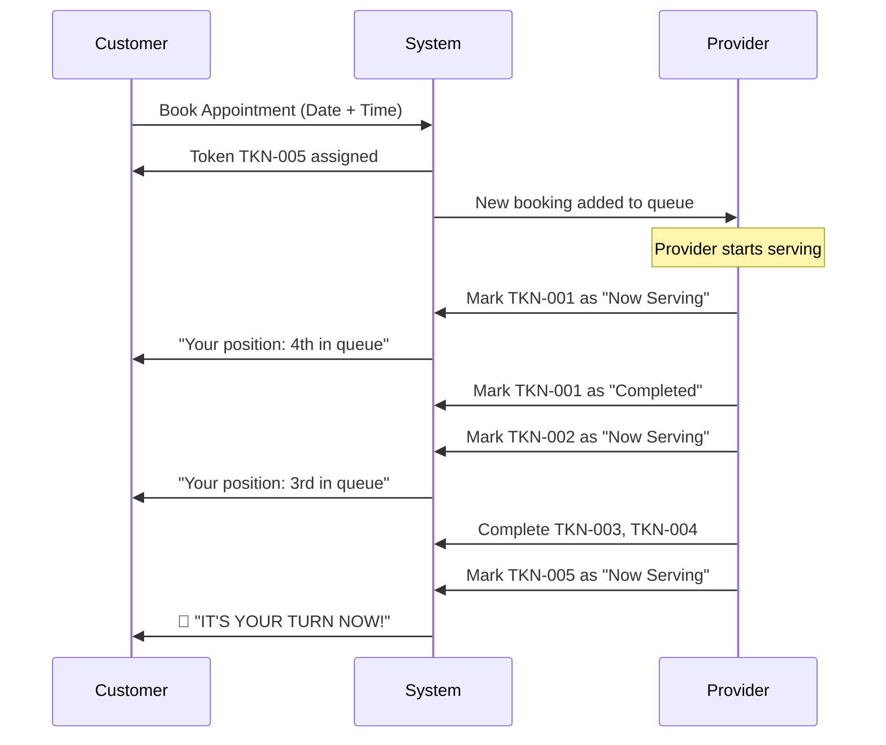

# BookNex - SaaS Research & Advanced Features

---

## 🔄 Part 1: Turn/Token Queue System

### What is a Turn-Based Token System?

Think of it like a **bank token system**:
1. Customer books appointment → Gets **Token Number** (e.g. TKN-001)
2. Customer can see: _"You are Token #5, Current Turn: Token #3"_
3. Provider can see: _"Now Serving: Token #3"_ and move to next token
4. Customer gets notified: _"Your turn is coming! 2 people ahead of you"_

### How It Works



### Key Features to Build

| Feature | Customer Sees | Provider Sees |
|---------|--------------|---------------|
| **Token Number** | "Your Token: TKN-005" | Full token queue list |
| **Queue Position** | "You are 4th in line" | Total pending count |
| **Current Turn** | "Now Serving: TKN-003" | Current active token |
| **ETA** | "Estimated wait: ~40 min" | Avg service time |
| **Status** | Waiting → Your Turn → Completed | Manage each token |

### Database Changes Needed

```sql
-- Add to appointments table
ALTER TABLE appointments ADD COLUMN queue_number INT;
ALTER TABLE appointments ADD COLUMN served_at DATETIME;
ALTER TABLE appointments ADD COLUMN completed_at DATETIME;

-- Provider's current serving token tracking
CREATE TABLE provider_queue_status (
    id INT PRIMARY KEY AUTO_INCREMENT,
    provider_id INT,
    current_token_id INT,
    date DATE,
    FOREIGN KEY (provider_id) REFERENCES providers(id)
);
```

### Implementation Plan

**Backend APIs:**
- `GET /provider/queue/today` — Today's queue sorted by time
- `PATCH /provider/queue/:id/serve` — Mark token as "now serving"
- `PATCH /provider/queue/:id/complete` — Complete current token
- `PATCH /provider/queue/:id/skip` — Skip/no-show
- `GET /customer/queue/status` — Customer's position & current turn

**Flutter Screens:**
- Provider: Queue Management Screen (list + "Next" button)
- Customer: Live Queue Status widget (position + current turn)

---

## 🚀 Part 2: Module-Wise Advanced Features for Industry-Ready SaaS

### Module 1: Authentication & Security

| Feature | Priority | Complexity |
|---------|----------|------------|
| Social Login (Google, Apple) | 🔴 High | Medium |
| Two-Factor Auth (2FA/OTP) | 🔴 High | Medium |
| Biometric Login (Fingerprint/Face) | 🟡 Medium | Low |
| Session Management (multi-device) | 🟡 Medium | Medium |
| Role-based Permissions (granular) | 🔴 High | High |
| Account Deletion (GDPR/DPDP) | 🔴 High | Low |
| Login with Mobile OTP | 🔴 High | Medium |
| IP-based Rate Limiting | 🟡 Medium | Low |
| Password Strength Meter | 🟢 Low | Low |

---

### Module 2: Service Provider Portal

| Feature | Priority | Complexity |
|---------|----------|------------|
| Multi-branch Support | 🔴 High | High |
| Staff Management (add employees) | 🔴 High | High |
| Service Categories & Sub-categories | 🟡 Medium | Medium |
| Service Images / Gallery | 🟡 Medium | Medium |
| Dynamic Pricing (peak/off-peak) | 🟡 Medium | Medium |
| Break Time Management | 🔴 High | Low |
| Holiday Calendar | 🔴 High | Low |
| Business Hours Override (special days) | 🟡 Medium | Medium |
| Service Duration Variants | 🟡 Medium | Low |
| Package/Combo Deals | 🟡 Medium | Medium |
| Cancellation Policy Settings | 🔴 High | Low |
| Auto-accept / Manual Accept Bookings | 🔴 High | Low |
| Provider Verification (KYC/Aadhaar) | 🔴 High | High |

---

### Module 3: Customer App & Booking

| Feature | Priority | Complexity |
|---------|----------|------------|
| **Turn-Based Queue System** | 🔴 High | Medium |
| Search with Filters (price, rating, distance) | 🔴 High | Medium |
| Favorite / Save Providers | 🟡 Medium | Low |
| Booking History with Re-book | 🟡 Medium | Low |
| Rating & Review System (1-5 stars) | 🔴 High | Medium |
| Photo Reviews | 🟡 Medium | Medium |
| GPS-based Nearby Providers | 🔴 High | High |
| Multiple Address Book | 🟡 Medium | Low |
| Group/Family Booking | 🟡 Medium | Medium |
| Waitlist (join when fully booked) | 🟡 Medium | Medium |
| Recurring Appointments | 🟡 Medium | Medium |
| In-app Chat (Customer ↔ Provider) | 🔴 High | High |
| QR Code Check-in | 🟡 Medium | Medium |
| Share Provider Profile / Referral | 🟡 Medium | Low |

---

### Module 4: Payments & Wallet

| Feature | Priority | Complexity |
|---------|----------|------------|
| Razorpay / UPI Integration | 🔴 High | Medium |
| In-app Wallet (Top-up + Auto-deduct) | 🔴 High | High |
| Partial Payment / Advance Deposit | 🟡 Medium | Medium |
| Refund Management | 🔴 High | Medium |
| Commission System (platform fee %) | 🔴 High | Medium |
| Invoice / Receipt Generation (PDF) | 🔴 High | Medium |
| GST / Tax Calculation | 🟡 Medium | Medium |
| Payout to Provider (settlement) | 🔴 High | High |
| Subscription Plans (for providers) | 🔴 High | High |
| Loyalty Points / Cashback | 🟡 Medium | Medium |
| Coupon / Promo Code System | 🟡 Medium | Medium |
| Transaction History with Export | 🔴 High | Low |

---

### Module 5: Admin Dashboard

| Feature | Priority | Complexity |
|---------|----------|------------|
| Real-time Analytics Dashboard | 🔴 High | Medium |
| Revenue Reports with Charts | 🔴 High | Medium |
| User Growth Charts | 🟡 Medium | Medium |
| Provider Performance Metrics | 🟡 Medium | Medium |
| Dispute / Complaint Management | 🔴 High | Medium |
| Configurable Commission Rates | 🔴 High | Low |
| System Configuration Panel | 🟡 Medium | Medium |
| Email Templates Manager | 🟡 Medium | Medium |
| Bulk Notifications (SMS/Push) | 🟡 Medium | Medium |
| Audit Trail / Activity Logs | ✅ Done | — |
| KYC Verification Panel | 🔴 High | High |
| Content Management (FAQ, About) | 🟢 Low | Medium |
| Export Data (CSV/Excel) | 🟡 Medium | Low |

---

### Module 6: Notifications & Communication

| Feature | Priority | Complexity |
|---------|----------|------------|
| Push Notifications (FCM) | 🔴 High | Medium |
| SMS Notifications (Twilio/MSG91) | 🔴 High | Medium |
| WhatsApp Notifications (API) | 🟡 Medium | High |
| Email Templates (HTML) | 🟡 Medium | Medium |
| In-app Notification Center | 🔴 High | Medium |
| Booking Reminders (auto 1hr before) | 🔴 High | Medium |
| No-show Follow-up | 🟡 Medium | Low |
| Review Request (post-service) | 🟡 Medium | Low |

---

### Module 7: Multi-tenancy & SaaS

| Feature | Priority | Complexity |
|---------|----------|------------|
| White-label Solution | 🔴 High | High |
| Custom Domain per Business | 🟡 Medium | High |
| Multi-language Support (i18n) | 🟡 Medium | High |
| Multi-currency Support | 🟡 Medium | Medium |
| Subscription Billing (Provider Plans) | 🔴 High | High |
| Tiered Pricing (Basic/Pro/Enterprise) | 🔴 High | Medium |
| API Access for Providers | 🟡 Medium | High |
| Custom Branding per Provider | 🟡 Medium | Medium |

---

### Module 8: AI & Smart Features

| Feature | Priority | Complexity |
|---------|----------|------------|
| Smart Scheduling (AI recommendation) | 🟡 Medium | High |
| Demand Prediction (busy hours) | 🟡 Medium | High |
| Chatbot for Booking | 🟡 Medium | High |
| Auto-pricing based on Demand | 🟢 Low | High |
| Sentiment Analysis on Reviews | 🟢 Low | High |
| Voice-based Booking | 🟢 Low | Very High |

---

## 📊 Priority Roadmap (Recommended Order)

| Phase | What to Build | Impact |
|-------|--------------|--------|
| **Next** | Turn Queue System + Ratings + Reviews | Core UX |
| **Phase 4** | Razorpay + Wallet + Invoice | Revenue |
| **Phase 6** | Push Notifications + FCM | Engagement |
| **Phase 7** | GPS Nearby + Search Filters | Discovery |
| **Phase 8** | Commission + Provider Payouts | Business Model |
| **Phase 9** | Staff Management + Multi-branch | Scale |
| **Phase 10** | Subscription Plans + White-label | SaaS Revenue |
| **Phase 11** | AI Features + Chatbot | Innovation |

---

> **Industry Reference:** Platforms like **Practo, Urban Company, Calendly, SimplyBook.me** have these features. BookNex can become a competitive alternative with proper execution.
